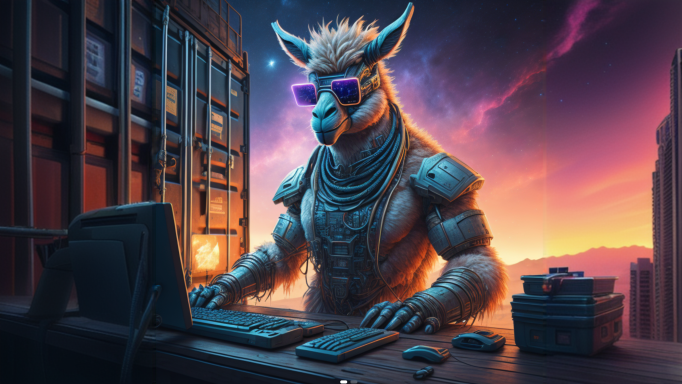
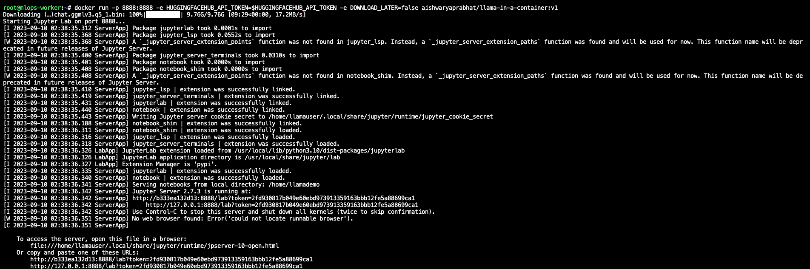
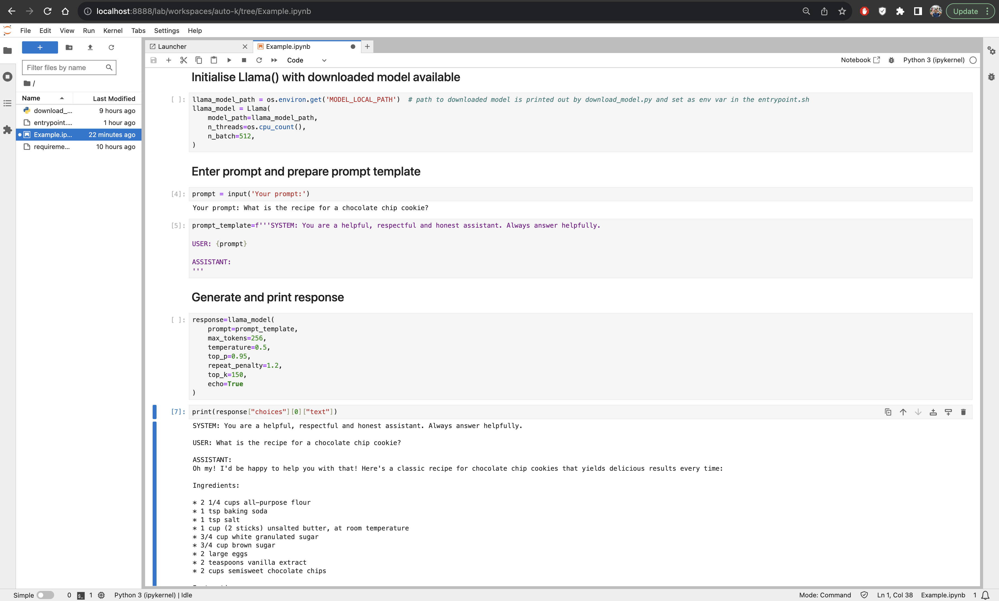

# 🦙Llama in a Container📦


This project provides a Docker container that you can start with just one `docker run` command, allowing you to quickly get up and running with Llama2 on your local laptop, workstation or anywhere for that matter! 🚀

## TL;DR 🙄 
```bash
docker run -p 8888:8888 -e HUGGINGFACEHUB_API_TOKEN=<YOUR_API_TOKEN> aishwaryaprabhat/llama-in-a-container:v1
```

## Features 🌟

- **Hassle-free Setup**: Get started with Llama2 effortlessly using a single command.
- **Customizable Environment**: Modify the environment variables to choose the LLM you want to download in the container.
- **Jupyter Lab Included**: Access Jupyter Lab for interactive NLP experimentation.

## Prerequisites 📋

Before you dive into the world of Llama2 with this container, make sure you have the following prerequisites ready:

- [Docker](https://www.docker.com/get-started) 🐳
- [Hugging Face Access Token](https://huggingface.co/docs/hub/security-tokens) 🔐
- [Git](https://git-scm.com/book/en/v2/Getting-Started-Installing-Git) (Optional for version control) 📦

## Usage 🚀

## Option 1: Run right away 🏃‍♂️ 
There is a pre-built container ready and waiting for you to run and start tinkering with Llama2. Just run

```bash
docker run -p 8888:8888 -e HUGGINGFACEHUB_API_TOKEN=<YOUR_API_TOKEN> aishwaryaprabhat/llama-in-a-container:v1
```

Replace `YOUR_API_TOKEN` with your Hugging Face Hub API token. If you don't have an API token, you can obtain one from [Hugging Face](https://huggingface.co/docs/hub/security-tokens). 🛡️

Depending on the speed of model download, you should soon see the following on your terminal:


Once the container is up and running, access Jupyter Lab by opening your web browser and navigating to:

```
http://localhost:8888/lab
```
There is some code waiting and ready in [Example.ipynb](Example.ipynb) for you to get your hands dirty!

## Option 2: Dip into the sauce (source) 🥫
If you'd like to play around with the Dockerfile or any of the other scripts...

#### 1. Clone the Repository 🧑‍💻

First, clone the Llama in a Container repository to your local machine:

```bash
git clone https://github.com/aishwaryaprabhat/llama-in-a-container.git
cd llama-in-a-container
```

#### 2. Build the Docker Image 🏗️

Build the Docker image using the provided Dockerfile. This step will set up the container with all the necessary dependencies:

```bash
docker build -t llama-in-a-container .
```

#### 3. Start the Container 🚢

Now, you can start the container with a single command. The following command starts the container and exposes Jupyter Lab on port 8888:

```bash
docker run -p 8888:8888 -e HUGGINGFACEHUB_API_TOKEN=<YOUR_API_TOKEN> llama-in-a-container
```

Replace `YOUR_API_TOKEN` with your Hugging Face Hub API token. If you don't have an API token, you can obtain one from [Hugging Face](https://huggingface.co/docs/hub/security-tokens). 🔑

#### 4. Access Jupyter Lab 🖥️

Once the container is up and running, access Jupyter Lab by opening your web browser and navigating to:

```
http://localhost:8888/lab
```

You can now start using Llama2 for your NLP tasks right from your web browser! 📊

## Customization 🛠️

Llama in a Container allows you to customize your environment by modifying the following environment variables in the Dockerfile:

- `HUGGINGFACEHUB_API_TOKEN`: Your Hugging Face Hub API token (required).
- `HF_REPO`: The Hugging Face model repository (default: TheBloke/Llama-2-13B-chat-GGML).
- `HF_MODEL_FILE`: The Llama2 model file (default: llama-2-13b-chat.ggmlv3.q5_1.bin).
- `JUPYTER_PORT`: The port for Jupyter Lab (default: 8888).
- `DOWNLOAD_LATER`: Set to "true" to skip model download (default: false). 🔄

## Issues and Contributions 🤝

If you encounter any issues or have suggestions for improvements, please feel free to [open an issue](https://github.com/aishwaryaprabhat/llama-in-a-container/issues) on the GitHub repository. Contributions and pull requests are also welcome! 🙌

## License 📄

This project is licensed under the [Llama2 Community License](LICENSE) file for details. 📜

Happy llama-ing! 🦙📦